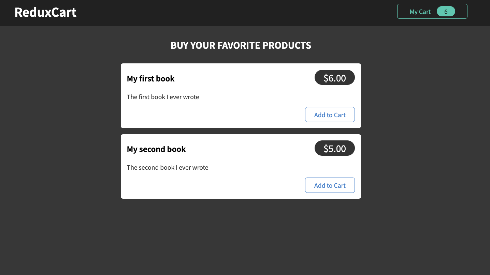
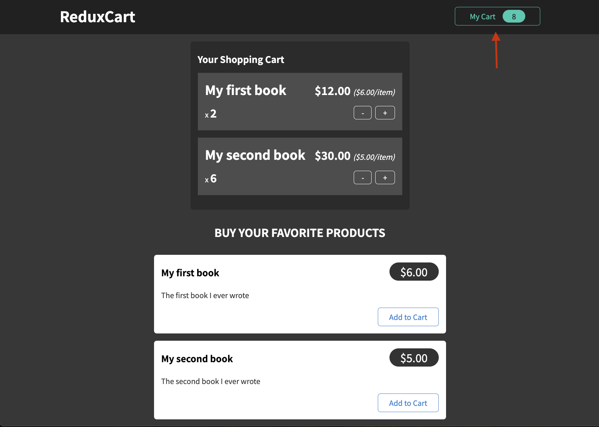
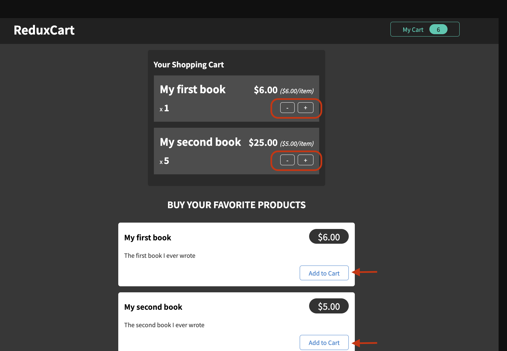
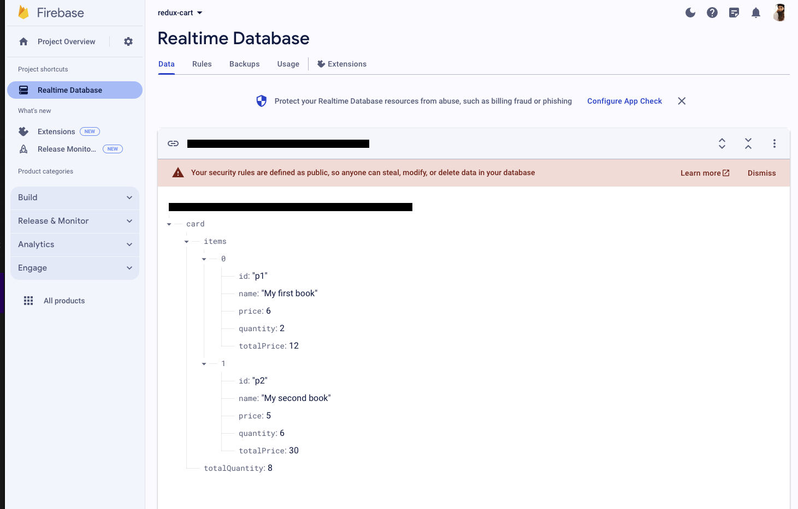

## Redux Cart

Dependencies are used;
- react-redux
- redux
- reduxjs/toolkit
- Firebase , Realtime Database


When you first run this project, you will see a screen like this.




When you click on the My Cart button in the upper right corner, the Your Shopping Cart component becomes visible on the screen. Favorite products purchased are listed here.



By clicking on the + and - buttons enclosed in red stripes, you can increase or decrease the number of added products.

You can make the first addition to the Your Shopping component by clicking on the Add to Cart button indicated by the red arrow.




The product information is contained in an array created under the name DUMMY_PRODUCTS.

```js
const DUMMY_PRODUCTS = [
  {
    id:'p1',
    price:6,
    title:'My first book',
    description:'The first book I ever wrote',
  },
  {
    id:'p2',
    price:5,
    title:'My second book',
    description:'The second book I ever wrote',
  },
]
```

Added and removed products are kept in the Realtime Database in the background.


